# Data Flora 🌿📊

> **Análise da relação entre Arborização Urbana, Saúde Arbórea (estimada), Qualidade do Ar e Estratificação Socioeconômica no Município do Rio de Janeiro.**

[](https://www.python.org/)
[]()
[]()
[-purple.svg)]()

---

## 📑 Índice

1. [Contexto do Projeto](#-contexto-do-projeto)
   - [Pergunta Central de Pesquisa](#pergunta-central-de-pesquisa)
   - [Recorte Temporal e Territorial](#recorte-temporal-e-territorial)
   - [Fontes e Natureza dos Dados](#fontes-e-natureza-dos-dados)
   - [Métrica Derivada: ISA 2024](#métrica-derivada-índice-de-saúde-arbórea-isa)
2. [Arquitetura de Dados Medallion](#-arquitetura-de-dados-medallion)
3. [Estrutura do Repositório](#-estrutura-do-repositório)
4. [Instruções de Execução do Projeto](#-instruções-de-execução-do-projeto)
   - [1. Pré-requisitos](#1-pré-requisitos)
   - [2. Instalação do Ambiente](#2-instalação-do-ambiente)
   - [3. Pipeline de Execução (Passo a Passo)](#3-pipeline-de-execução-passo-a-passo)
   - [4. O que esperar como saída](#4-o-que-esperar-como-saída)
5. [Modelagem Estatística e Indicadores Analíticos](#-modelagem-estatística-e-indicadores-analíticos)
6. [Integração com Looker Studio](#-integração-com-looker-studio)
7. [Contribuidores](#-contribuidores)

---

## 🌍 Contexto do Projeto

O **Data Flora** é um projeto analítico e de engenharia de dados socioambientais focado na cidade do Rio de Janeiro. A iniciativa integra bases de dados públicas municipais e federais para investigar disparidades territoriais de arborização, microclima e poluição atmosférica, avaliando impactos na qualidade de vida urbana.

### Pergunta Central de Pesquisa

> **Regiões de menor nível socioeconômico possuem menor cobertura arbórea — e as árvores presentes nessas áreas encontram-se sob pior estado de saúde e maior estresse ambiental em comparação às regiões mais nobres?**

Para responder a essa questão, são investigadas três frentes de causalidade:
1. **Desigualdade Estrutural de Cobertura:** Avaliação da correlação entre o Índice de Progresso Social (IPS) e a presença de arborização nas vias públicas.
2. **Carga e Exposição a Poluentes:** Análise da concentração e aceleração de poluentes atmosféricos ($\text{PM}_{10}$, $\text{PM}_{2.5}$, $\text{O}_3$, $\text{NO}_2$) nas diferentes regiões.
3. **Degradação e Estresse Vegetal:** Estimativa do estresse microclimático acumulado (ondas de calor, estiagens/baixa umidade, chuvas torrenciais e poluição) atuante sobre o patrimônio arbóreo.

### Recorte Temporal e Territorial

* **Recorte Temporal:** **Ano de 2024** fechado (01/01/2024 a 31/12/2024 — 366 dias, ano bissexto).
* **Unidade Territorial:** As **8 estações fixas de monitoramento contínuo da qualidade do ar (MonitorAr-Rio)** mapeadas para as suas respectivas Regiões Administrativas (RA):

| Estação MonitorAr | Código RA | Nome Oficial RA | Perfil Socioespacial Predominante |
| :--- | :---: | :--- | :--- |
| **Centro (`AV`)** | II | II — Centro | Comercial / Histórico / Tráfego Intenso |
| **São Cristóvão (`SC`)** | VII | VII — São Cristóvão | Industrial / Urbano / Zona Norte |
| **Copacabana (`CA`)** | V | V — Copacabana | Residencial Nobre / Alta Densidade / Zona Sul |
| **Tijuca (`SP`)** | VIII | VIII — Tijuca | Residencial Tradicional / Encosta / Zona Norte |
| **Irajá (`IR`)** | XIV | XIV — Irajá | Suburbano / Baixo IPS / Zona Norte |
| **Bangu (`BG`)** | XVII | XVII — Bangu | Periférico / Clima Extremo (Calor) / Zona Oeste |
| **Campo Grande (`CG`)** | XVIII | XVIII — Campo Grande | Polo Regional / Expansão / Zona Oeste |
| **Pedra de Guaratiba (`PG`)** | XXVI | XXVI — Guaratiba | Litoral Oeste / Área Semiurbana / Zona Oeste |

### Fontes e Natureza dos Dados

As variáveis utilizadas no projeto possuem rigidez metodológica documentada em [`docs/dicionario_de_dados.md`](docs/dicionario_de_dados.md):

* **MonitorAr-Rio (SMAC / PCRJ):** **Dado Real (2024)**. Série horária com poluentes ($\text{PM}_{10}$, $\text{PM}_{2.5}$, $\text{O}_3$, $\text{NO}_2$, $\text{CO}$, $\text{SO}_2$) e variáveis meteorológicas (temperatura, umidade relativa, chuva, vento, pressão, radiação).
* **Censo Demográfico 2022 — Entorno dos Domicílios (IBGE):** **Dado Proxy Estrutural**. Métrica de arborização em calçadas/vias públicas agregada de 162 bairros para as 8 RAs. Utilizado como proxy de 2024 devido à lenta mutação da malha arbórea e à inexistência de Censo anual.
* **Índice de Progresso Social — IPS Rio 2024 (IPP / data.rio):** **Dado Real (2024)**. Estratificação socioeconômica por RA (IPS Geral, Dimensões de Necessidades Humanas Básicas, Fundamentos do Bem-Estar e Oportunidades).

### Métrica Derivada: Índice de Saúde Arbórea (ISA)

Como a cidade do Rio de Janeiro não dispõe de um inventário fitossanitário público contínuo por região, foi formulado o **ISA 2024**, um **indicador sintético derivado exclusivamente de estressores ambientais e meteorológicos de 2024**:
* **Estresse Térmico ($E_{\text{calor}}$):** Total mensal de horas com temperatura $> 32\,^\circ\text{C}$.
* **Estresse Hídrico ($E_{\text{seco}}$):** Total mensal de horas com umidade relativa $< 40\%$.
* **Estresse de Alagamento ($E_{\text{chuva}}$):** Total mensal de dias com chuva acumulada $> 50\,\text{mm}$.
* **Estresse por Poluição ($E_{\text{poluicao}}$):** Média mensal de $\text{PM}_{10}$.

$$\text{ISA}_{\text{bruto}} = 100 - (30 \cdot E_{\text{calor}} + 20 \cdot E_{\text{seco}} + 20 \cdot E_{\text{chuva}} + 30 \cdot E_{\text{poluicao}})$$
$$\text{ISA} = \text{clip}\left(\text{ISA}_{\text{bruto}} + \epsilon,\, 0,\, 100\right), \quad \epsilon \sim \mathcal{N}(0, 3^2)$$

> **Regra Anti-Circularidade:** Renda e IPS **nunca** entram no cálculo do ISA. A correlação socioambiental emerge genuinamente dos dados observados.

---

## 🏗 Arquitetura de Dados Medallion

O pipeline opera em três camadas bem delimitadas:

```mermaid
flowchart LR
    subgraph BRONZE["Camada Bronze (Raw Ingestion)"]
        B1["monitorar_horario_2024.csv"]
        B2["ibge_entorno_bairro_BR.csv"]
        B3["ips_ra_2024.xlsx"]
    end

    subgraph SILVER["Camada Silver (Higienizada & Pré-Estatística)"]
        S1["monitorar_horario_rj_2024.csv<br>(70.272 linhas horárias)"]
        S2["ibge_entorno_bairro_rj.csv<br>(162 bairros RJ)"]
        S3["ips_ra_rj_2024.xlsx"]
    end

    subgraph GOLD["Camada Gold (Analítica & Estatística)"]
        G1["gold/massa_dados.csv<br>(2.928 linhas diárias × 40 colunas)"]
        G2["gold/massa_horaria_rj_2024.parquet<br>(70.272 registros horários validados)"]
    end

    BRONZE -->|"Filtro Territorial RJ"| SILVER
    SILVER -->|"Agregação, Derivadas, Integrais & ISA"| GOLD
```



* **Bronze:** Cópia idêntica dos dados extraídos dos portais públicos oficiais.
* **Silver (Pré-Estatística):** Dados recortados espacialmente para o Rio de Janeiro, preservando granularidades e estruturas de colunas originais das fontes.
* **Gold (Estatística & Modelagem):** Agregação temporal para o grão diário ($8 \text{ RAs} \times 366 \text{ dias} = 2.928 \text{ linhas}$), validação contra limites físicos, rastreamento de outliers (IQR), cálculo de derivadas ($\frac{dY}{dt}$), integrais acumuladas ($\int Y dt$) e síntese do ISA.

---

## 📁 Estrutura do Repositório

```
Data-Flora/
├── bronze/                 # Camada Bronze: dados brutos exatamente como ingeridos
│   ├── monitorar_horario_2024.csv
│   ├── ibge_entorno_bairro_BR.csv
│   └── ips_ra_2024.xlsx
├── silver/                 # Camada Silver: dados higienizados e filtrados para o RJ
│   ├── monitorar_horario_rj_2024.csv
│   ├── ibge_entorno_bairro_rj.csv
│   └── ips_ra_rj_2024.xlsx
├── gold/                   # Camada Gold: massas finais consolidadas e tipadas
│   ├── massa_dados.csv     # Grão Diário (2.928 linhas × 40 colunas)
│   └── massa_horaria_rj_2024.parquet # Série horária completa (70.272 registros)
├── docs/                   # Documentação técnica e especificações
│   ├── plano_arborizacao_rj.md            # Plano de desenvolvimento v3.1
│   ├── dicionario_de_dados.md             # Dicionário de dados descritivo
│   ├── dicionario_de_dados.csv            # Metadados e catálogo em formato tabular
│   └── especificacao_etl_silver_gold.md   # Formulações matemáticas e regras de ETL
├── scripts/                # Scripts de extração automatizada e pipelines de dados
│   ├── 01_extract_monitorar.py            # Extração da API ArcGIS (MonitorAr-Rio)
│   ├── 02_extract_ibge_entorno.py         # Download e extração do FTP do IBGE
│   ├── 03_extract_ips.py                  # Download oficial da planilha do IPS Rio
│   ├── 04_organize_bronze_silver.py       # Organização e filtragem Bronze -> Silver
│   └── 05_run_etl_gold.py                 # Pipeline de Engenharia & Estatística Silver -> Gold
├── requirements.txt        # Dependências do ecossistema Python
├── README_EXECUCAO.md      # Guia rápido focado no ambiente local de extração
└── README.md               # Este documento
```

---

## 🚀 Instruções de Execução do Projeto

### 1. Pré-requisitos
* Python 3.10 ou superior instalado.
* Conexão estável com a internet (para execução dos scripts de download).
* Git instalado e configurado.

### 2. Instalação do Ambiente

Clone o repositório e instale as dependências:

```bash
git clone https://github.com/Arilden/Data-Flora.git
cd Data-Flora
pip install -r requirements.txt
```

### 3. Pipeline de Execução (Passo a Passo)

Execute os scripts sequencialmente a partir da raiz do projeto:

#### Passo A: Extração das Fontes Primárias
```bash
# 1. Extrai medições horárias de 2024 do MonitorAr-Rio (~70 mil registros)
python scripts/01_extract_monitorar.py

# 2. Baixa agregados por bairro do Censo 2022 (IBGE Entorno)
python scripts/02_extract_ibge_entorno.py

# 3. Baixa a planilha oficial do IPS Rio 2024 (IPP)
python scripts/03_extract_ips.py
```

#### Passo B: Estruturação das Camadas Bronze e Silver
```bash
# Organiza os arquivos brutos em bronze/ e filtra os recortes do RJ em silver/
python scripts/04_organize_bronze_silver.py
```

#### Passo C: Execução do ETL Silver $\to$ Gold (Engenharia de Variáveis & Estatística)
```bash
# Executa limpeza, IQR, agregações, derivadas, integrais e síntese do ISA
python scripts/05_run_etl_gold.py
```

### 4. O que esperar como saída

Ao término do pipeline, você terá:
1. Em `silver/`: Arquivos filtrados exclusivamente para o município do Rio de Janeiro no formato original das fontes.
2. Em `gold/massa_dados.csv`: Arquivo CSV codificado em `UTF-8 com BOM`, com **2.928 linhas** e **40 colunas**, pronto para consumo analítico.
3. Em `gold/massa_horaria_rj_2024.parquet`: Base horária colunar compactada com **70.272 linhas**, pronta para ambientes de Big Data / Databricks.

---

## 📈 Modelagem Estatística e Indicadores Analíticos

A massa analítica consolidada em `gold/massa_dados.csv` contempla:

* **Estatística Descritiva & Limites Físicos:** Limpeza e validação de sensores climáticos e particulados.
* **Identificação de Outliers por IQR:** Rastreamento pontual de eventos atípicos via $Q_3 + 1.5 \cdot \text{IQR}$ (`flag_outlier_pm10`).
* **Cálculo Diferencial Discreto ($\frac{dY}{dt}$):** Aplicação de gradiente por diferenças finitas centrais em $\text{PM}_{10}$ e Temperatura para detecção de picos de aceleração de poluição e choques térmicos (`derivada_pm10`, `derivada_temp`).
* **Cálculo Integral Numérico ($\int Y dt$):** Aplicação acumulada da Regra dos Trapézios para calcular a exposição acumulada anual de particulados inalados pela população (`integral_acumulada_pm10`, `integral_acumulada_pm2_5`).
* **Índice Derivado de Saúde Arbórea:** Score contínuo (0 a 100) e estratificação diagnóstica (`Boa`, `Regular`, `Ruim`).

---

## 📊 Integração com Looker Studio

A base `gold/massa_dados.csv` foi concebida para alimentação direta de dashboards no **Google Looker Studio** (via Google Sheets ou conector CSV/Drive):

1. **Painel 1 — Desigualdade Socioespacial e Cobertura Arbórea:** Gráficos de barras e mapas geolocalizados via `lat` e `lon` cruzando `ips_2024` com `pct_arborizacao_2022`.
2. **Painel 2 — Dinâmica Temporal e Picos de Poluição:** Séries temporais interativas de poluentes e indicadores de taxa instantânea (`derivada_pm10`).
3. **Painel 3 — Exposição Acumulada Anual:** Curva de acúmulo e ranking regional de carga total inalada (`integral_acumulada_pm10`).
4. **Painel 4 — Cruzamento IPS $\times$ ISA:** Dispersão com linhas de tendência e distribuição das classes de saúde arbórea (`isa_classe`).

> 💡 **Nota de BI:** Para variáveis estáticas ou mensais (como `ips_2024`, `pct_arborizacao_2022` e `isa`), configure o método de agregação no Looker Studio como **`MÉDIA`** ou **`MÁXIMO`** (e não `SOMA`), preservando o grão analítico correto.

---

## 👥 Contribuidores

Projeto desenvolvido para o portfólio de Engenharia e Análise de Dados:

* **Victor Guida** — [GitHub: @Arilden](https://github.com/Arilden)
* **Rosimery Santos** — [GitHub: @rosystt](https://github.com/rosystt)

---
*Data Flora — Ciência de Dados a serviço da sustentabilidade urbana e da justiça socioambiental no Rio de Janeiro.*
