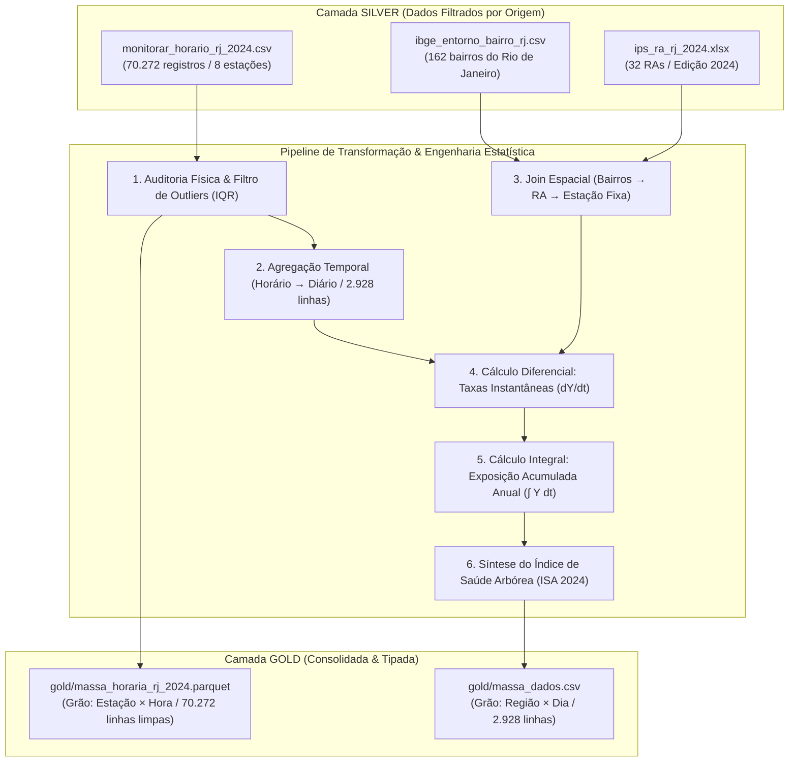

# Especificação Técnica do Pipeline de ETL (Silver → Gold)

**Projeto:** Data Flora — Arborização, Saúde Arbórea e Qualidade do Ar no Rio de Janeiro  
**Versão:** 1.0  
**Data:** 11/09/2026  
**Recorte Temporal:** Ano de 2024 (01/01/2024 a 31/12/2024 — 366 dias)  

---

## 1. Visão Geral e Arquitetura de Dados

O pipeline de ETL (Extract, Transform, Load) consolida os dados pré-processados na camada **Silver** e produz as massas de dados definitivas na camada **Gold**, prontas para o consumo analítico (análises estatísticas, modelagem, testes de hipóteses, geração de planilhas Excel dinâmicas e painéis do Looker Studio).

---

## 2. Detalhamento Metodológico das Transformações

### 2.1 Limpeza de Dados e Faixas de Validade Física
Cada registro horário passa por uma validação contra limites físicos aceitáveis:
* **Temperatura (`temp`):** $-5,0^\circ\text{C} \le \text{temp} \le 50,0^\circ\text{C}$ (valores além deste intervalo são convertidos para nulos).
* **Umidade Relativa (`ur`):** $0,0\% \le \text{ur} \le 100,0\%$.
* **Chuva (`chuva`):** $\ge 0,0\,\text{mm/h}$.
* **Poluentes atmosféricos ($\text{PM}_{10}, \text{PM}_{2.5}, \text{O}_3, \text{NO}_2, \text{SO}_2, \text{CO}$):** $\ge 0,0$ (leituras negativas de sensores são tratadas como nulas ou ajustadas para zero se forem artefatos de calibração).

### 2.2 Detecção de Outliers e Rastreabilidade
Para a série de $\text{PM}_{10}$, os limites de corte interquartil são calculados para cada estação $k$:
$$\text{IQR}_k = Q_{3, k} - Q_{1, k}$$
$$\text{Limite Superior}_k = Q_{3, k} + 1,5 \cdot \text{IQR}_k$$
* Registros acima do limite superior são marcados com `flag_outlier_pm10 = 1`.
* Para cálculo das métricas diárias, os outliers são truncados (*winsorization*) no percentil 99 ou substituídos pela mediana local para evitar distorção na integração contínua.

### 2.3 Tratamento de Nulos e Imputação Temporal
1. **Regra de Representatividade Diária:** Um dia é considerado com dados válidos se possuir ao menos **12 horas de medição** ($\ge 50\%$ do dia). A média diária é calculada com base nas horas válidas.
2. **Dias Totalmente Nulos:** Para dias sem medições, aplica-se interpolação linear ponderada no tempo ao longo da série diária da estação, preenchendo a coluna `flag_imputado = 1` para garantir transparência.
3. **Casos Especiais de Estações:**
   * **São Cristóvão (`SC`):** Mantém-se as flags de missing ativo para documentar a indisponibilidade real dos sensores durante 2024.
   * **Material Particulado Fino ($\text{PM}_{2.5}$):** O sensor opera na estação Irajá (`IR`). Para as demais estações, o campo mantém-se nulo no grão diário e a integral de exposição acumulada utiliza $\text{PM}_{10}$.

### 2.4 Agregação Temporal (Horário → Diário)
O grão de 70.272 linhas horárias é sumarizado em **2.928 linhas diárias** ($8 \text{ regiões} \times 366 \text{ dias}$):
* **Médias Diárias:** $\text{PM}_{10}, \text{PM}_{2.5}, \text{O}_3, \text{NO}_2, \text{CO}, \text{SO}_2, \text{Temperatura}, \text{Umidade Relativa}$.
* **Extremos Diários:** $\text{PM}_{10\text{, max}}, \text{O}_{3\text{, max}}, \text{Temp}_{\text{max}}, \text{Temp}_{\text{min}}, \text{UR}_{\text{min}}$.
* **Precipitação Diária:** Soma de 24 horas ($\text{Chuva}_{\text{dia}} = \sum_{h=1}^{24} \text{chuva}_h$).

---

## 3. Harmonização Espacial (Bairros → RAs → MonitorAr)

O mapeamento territorial une as 8 estações da qualidade do ar com as Regiões Administrativas e com os bairros agregados do Censo IBGE 2022:

| Estação MonitorAr | Código RA | Nome Oficial RA | Bairros IBGE Agregados | Domicílios Totais (`V05000`) | Domicílios Arborizados (`V05027`) | % Arborização (Proxy 2022) | IPS Geral 2024 |
| :--- | :--- | :--- | :--- | :--- | :--- | :--- | :--- |
| **Centro (`AV`)** | II | II — Centro | Centro | 12.953 | 7.260 | **56,05%** | **57,66** |
| **São Cristóvão (`SC`)** | VII | VII — São Cristóvão | São Cristóvão, Mangueira, Benfica, Vasco da Gama | 32.001 | 4.475 | **13,98%** | **59,13** |
| **Copacabana (`CA`)** | V | V — Copacabana | Copacabana, Leme | 68.316 | 42.265 | **61,87%** | **84,10** |
| **Tijuca (`SP`)** | VIII | VIII — Tijuca | Tijuca, Alto da Boa Vista, Praça da Bandeira | 67.426 | 15.943 | **23,65%** | **79,51** |
| **Irajá (`IR`)** | XIV | XIV — Irajá | Irajá, Vicente de Carvalho, Vila Kosmos, Vila da Penha, Vista Alegre, Colégio | 69.588 | 19.534 | **28,07%** | **65,82** |
| **Bangu (`BG`)** | XVII | XVII — Bangu | Bangu, Padre Miguel, Senador Camará, Gericinó | 140.676 | 8.940 | **6,36%** | **57,47** |
| **Campo Grande (`CG`)** | XVIII | XVIII — Campo Grande | Campo Grande, Cosmos, Inhoaíba, Senador Vasconcelos, Santíssimo | 220.727 | 18.531 | **8,40%** | **62,45** |
| **Guaratiba (`PG`)** | XXVI | XXVI — Guaratiba | Guaratiba, Barra de Guaratiba, Pedra de Guaratiba | 63.703 | 8.163 | **12,81%** | **47,37** |

$$\text{pct\_arborizacao\_2022} = \frac{\sum_{\text{bairros} \in \text{RA}} \text{V05027}}{\sum_{\text{bairros} \in \text{RA}} \text{V05000}} \times 100$$

---

## 4. Engenharia de Variáveis: Limites, Derivadas, Integrais e ISA

### 4.1 Derivadas Numéricas Diárias (Taxa de Variação Instantânea)
Calculadas através de diferenças finitas centradas de segunda ordem para a série temporal contínua de cada região:
$$\frac{d(\text{PM}_{10})}{dt} \approx \frac{\text{PM}_{10}(t+1) - \text{PM}_{10}(t-1)}{2 \Delta t} \quad [\mu\text{g}/(\text{m}^3\cdot\text{dia})]$$
$$\frac{d(\text{Temp})}{dt} \approx \frac{\text{Temp}(t+1) - \text{Temp}(t-1)}{2 \Delta t} \quad [^\circ\text{C}/\text{dia}]$$
*Permite detectar dias de aceleração crítica de poluição e picos de choque térmico urbano.*

### 4.2 Integrais Definidas (Exposição Acumulada Anual)
A carga cumulativa de poluentes absorvida pelas árvores e inalada pela população é computada numericamente pela **Regra dos Trapézios Acumulada**:
$$\text{Integral Acumulada}(t) = \int_{0}^{t} \text{Poluente}(\tau) \, d\tau \approx \sum_{i=1}^{t} \frac{\text{Poluente}(i-1) + \text{Poluente}(i)}{2} \cdot \Delta t$$
*Resultado armazenado em `integral_acumulada_pm10` e `integral_acumulada_pm2_5`.*

### 4.3 Regra de Síntese do Índice de Saúde Arbórea (ISA 2024)
Para cada região $r$ e mês $m$ ($8 \text{ regiões} \times 12 \text{ meses} = 96 \text{ combinações}$), apuram-se 4 métricas físicas de estresse ambiental:
1. $E_{\text{calor}}$: Total de horas no mês com $\text{Temperatura} > 32,0^\circ\text{C}$.
2. $E_{\text{seco}}$: Total de horas no mês com $\text{Umidade Relativa} < 40,0\%$.
3. $E_{\text{chuva}}$: Total de dias no mês com $\text{Chuva} > 50,0\,\text{mm}$.
4. $E_{\text{poluicao}}$: Média mensal da concentração de $\text{PM}_{10}$ ($\mu\text{g/m}^3$).

**Normalização Min-Max:**
$$\hat{E} = \frac{E - \min(E)}{\max(E) - \min(E)} \in [0, 1]$$

**Fórmula de Síntese:**
$$\text{ISA}_{\text{bruto}} = 100 - \left(30 \cdot \hat{E}_{\text{calor}} + 20 \cdot \hat{E}_{\text{seco}} + 20 \cdot \hat{E}_{\text{chuva}} + 30 \cdot \hat{E}_{\text{poluicao}}\right)$$
$$\text{ISA} = \text{clip}\left(\text{ISA}_{\text{bruto}} + \epsilon,\, 0,\, 100\right), \quad \epsilon \sim \mathcal{N}(0, 3^2), \; \text{seed}=42$$

**Classes de Diagnóstico Vegetal:**
* **Boa:** $\text{ISA} \ge 70$
* **Regular:** $50 \le \text{ISA} < 70$
* **Ruim:** $\text{ISA} < 50$

---

## 5. Estrutura dos Arquivos de Saída (Camada Gold)

1. **`gold/massa_dados.csv`:**
   * **Linhas:** 2.928 ($8 \text{ estações} \times 366 \text{ dias de 2024}$).
   * **Colunas:** 37 campos padronizados de identificação temporal, espacial, qualidade do ar, meteorologia, derivadas, integrais, socioeconomia (IPS), arborização (IBGE), ISA e flags de qualidade.
2. **`gold/massa_horaria_rj_2024.parquet`:**
   * **Linhas:** 70.272 registros horários limpos e validados, particionados ou otimizados em formato colunar para uso em pipelines de Big Data / Databricks (SkyFlora).
