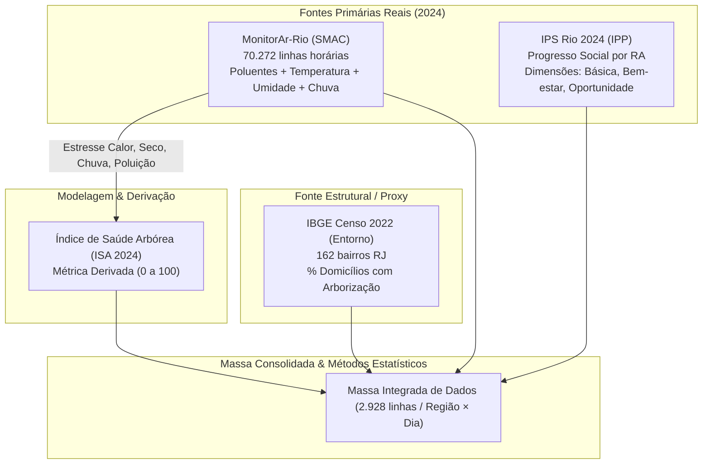

# Plano de Desenvolvimento — Arborização, Saúde Arbórea e Qualidade do Ar no Rio de Janeiro

**Versão:** 3.1 — 11/09/2026  
**Prazo de execução:** 5 dias  
**Recorte temporal:** ano de **2024**  

---

## 0. Objetivo e Pergunta de Pesquisa

O propósito central deste projeto é gerar **insights de tendência estatística** rigorosos e acionáveis a partir da integração de dados socioambientais do município do Rio de Janeiro no ano de 2024. O foco é investigar e quantificar as relações entre a **distribuição da arborização urbana**, a **estratificação socioeconômica**, a **qualidade do ar** e a **saúde vegetal/arbórea (estimada)** entre as diferentes regiões da cidade.

### Pergunta Central de Pesquisa:
> **Regiões de menor nível socioeconômico possuem menor cobertura arbórea — e as árvores presentes nessas áreas encontram-se sob pior estado de saúde e maior estresse ambiental em comparação às regiões mais nobres?**

### Hipóteses e Fatores de Causalidade Investigados:
1. **Desigualdade de Cobertura:** A distribuição da cobertura arbórea reflete a segregação socioeconômica territorial (estratificação medida pelo IPS).
2. **Qualidade do Ar e Exposição:** Regiões mais periféricas e com menor cobertura vegetal concentram maiores cargas de poluentes atmosféricos ($\text{PM}_{10}$, $\text{PM}_{2.5}$, $\text{O}_3$, $\text{NO}_2$).
3. **Estresse e Saúde Arbórea:** As condições microclimáticas desfavoráveis (ilhas de calor, baixa umidade relativa, eventos extremos de chuva) somadas à poluição aceleram a degradação da saúde vegetal (medida pelo índice derivado ISA).

### Unidade de Análise Territorial:
O grão territorial de integração baseia-se nas **8 estações fixas de monitoramento contínuo da qualidade do ar (MonitorAr-Rio)**, mapeadas diretamente para as suas respectivas **Regiões Administrativas (RA)** do município do Rio de Janeiro:

| Estação MonitorAr | Código RA | Região Administrativa (RA) | Perfil Socioespacial Predominante |
| :--- | :--- | :--- | :--- |
| **Centro** | II | II — Centro | Comercial / Histórico / Tráfego Intenso |
| **São Cristóvão** | VII | VII — São Cristóvão | Industrial / Urbano / Zona Norte |
| **Copacabana** | V | V — Copacabana | Residencial Nobre / Alta Densidade / Zona Sul |
| **Tijuca** | VIII | VIII — Tijuca | Residencial Tradicional / Encosta / Zona Norte |
| **Irajá** | XIV | XIV — Irajá | Suburbano / Baixo IPS / Zona Norte |
| **Bangu** | XVII | XVII — Bangu | Periférico / Clima Extremo (Calor) / Zona Oeste |
| **Campo Grande** | XVIII | XVIII — Campo Grande | Polo Regional Periférico / Expansão / Zona Oeste |
| **Pedra de Guaratiba** | XXVI | XXVI — Guaratiba | Litoral Oeste / Área Semiurbana / Zona Oeste |

---

## 1. Decisões de Escopo Registradas

| # | Decisão | Motivo / Justificativa | Onde impacta |
|---|---|---|---|
| **D1** | Massa principal restrita a **01/01/2024–31/12/2024** (366 dias, ano bissexto) | Escopo estrito do projeto: 2024 completo, sem diluição temporal multi-ano | Extração MonitorAr, ISA, Excel, dashboard |
| **D2** | MonitorAr filtrado direto na consulta (`where` da API) | Redução de ~420 mil para ~70 mil linhas horárias e otimização das requisições | `scripts/01_extract_monitorar.py` |
| **D3** | Sem conversão de fuso horário | O MonitorAr padronizou para GMT-3 em nov/2023; 2024 é 100% GMT-3 uniforme | Simplificação da limpeza de dados |
| **D4** | IPS: usar **somente a edição 2024** | O arquivo oficial traz a série histórica, mas a análise foca no patamar socioeconômico de 2024 | `scripts/03_extract_ips.py`, notebook de preparação |
| **D5** | Censo (arborização): edição **2022** usada como **PROXY** de 2024 | O Censo é decenal (não há 2024). Arborização urbana é estrutural e varia lentamente. Marcação obrigatória como *proxy* | Dicionário de dados, análises, dashboard |
| **D6** | ISA: **dado derivado** exclusivamente de variáveis ambientais (2024) | A renda/IPS **não entra** na fórmula do ISA para evitar raciocínio circular (a correlação deve emergir dos dados) | Cálculo ISA, dicionário, testes de hipóteses |
| **D7** | Alerta Rio como plano B (não automatizado) | MonitorAr já fornece temperatura, umidade e chuva no mesmo registro horário | Redução de complexidade e dependência de scraping |
| **D8** | Extração executada localmente | Scripts rodam no ambiente local da máquina para acesso irrestrito às fontes governamentais | `README_EXECUCAO.md`, pasta `dados_brutos/` |
| **D9** | **Dicionário de Dados Obrigatório** | Necessidade de padronização, tipagem, unidades de medida e categorização da natureza do dado (Real, Proxy, Derivado) | `docs/dicionario_de_dados.md`, aba "Dicionario" no Excel |

---

## 2. Fontes de Dados e Natureza das Informações



1. **MonitorAr-Rio (`monitorar_horario_2024.csv`):**
   * *Natureza:* **Dado Real** (2024).
   * *Variáveis:* `pm10`, `pm2_5`, `o3`, `no2`, `co`, `so2`, `temp`, `ur`, `chuva`, `dir_vento`, `vel_vento`, `pres`, `rs`.
   * *Finalidade:* Qualidade do ar, microclima e cálculo das derivadas, integrais e estressores do ISA.
2. **Censo IBGE Entorno (`ibge_entorno_bairro_rj.csv`):**
   * *Natureza:* **Dado Proxy** (Censo Demográfico 2022 para 2024).
   * *Variáveis:* Domicílios com arborização na calçada/via (`V05027` a `V05030`), total de domicílios, bueiros, pavimentação.
   * *Finalidade:* Métrica estrutural `% de Arborização por RA`.
3. **IPS Rio 2024 (`ips_ra_2024.xlsx`):**
   * *Natureza:* **Dado Real** (Edição 2024).
   * *Variáveis:* IPS Geral 2024, Componentes de Meio Ambiente, Moradia, Saúde.
   * *Finalidade:* Estratificação socioeconômica para testes de hipóteses e correlação.

---

## 3. Métrica Derivada: Índice de Saúde Arbórea (ISA) — Ano 2024

O ISA estima a saúde da vegetação urbana com base na severidade acumulada das condições ambientais às quais as árvores foram submetidas em cada mês de 2024:

### 3.1 Componentes de Estresse Ambiental (mensal por RA):
* **Estresse Térmico ($E_{\text{calor}}$):** Total de horas com $\text{temperatura} > 32\,^\circ\text{C}$.
* **Estresse Hídrico/Seco ($E_{\text{seco}}$):** Total de horas com $\text{umidade relativa} < 40\%$.
* **Estresse de Alagamento ($E_{\text{chuva}}$):** Total de dias com chuva acumulada $> 50\,\text{mm}$.
* **Estresse por Poluição ($E_{\text{poluicao}}$):** Concentração média mensal de $\text{PM}_{10}$ ($\mu\text{g/m}^3$).

### 3.2 Normalização e Síntese:
Cada componente é normalizado para a escala $[0, 1]$ (min-max sobre o painel de 8 regiões × 12 meses):

$$\text{ISA}_{\text{bruto}} = 100 - (30 \cdot E_{\text{calor}} + 20 \cdot E_{\text{seco}} + 20 \cdot E_{\text{chuva}} + 30 \cdot E_{\text{poluicao}})$$

$$\text{ISA} = \text{clip}\left(\text{ISA}_{\text{bruto}} + \epsilon,\, 0,\, 100\right), \quad \epsilon \sim \mathcal{N}(0, 3^2), \; \text{seed}=42$$

* **Categorias Clínicas:** Boa ($\ge 70$), Regular ($50\text{--}69$), Ruim ($< 50$).
* **Importante:** Sempre identificado explicitamente como **Índice Derivado**.

---

## 4. Pipeline e Métodos Estatísticos

O fluxo analítico foi desenhado para cobrir de ponta a ponta as exigências estatísticas aplicadas:


### 4.1 Preparação e Limpeza de Dados
* Tratamento de valores ausentes (taxa de missing por estação/poluente/mês).
* Identificação e tratamento de *outliers* via critério interquartil (IQR: $[Q_1 - 1.5\cdot\text{IQR}, Q_3 + 1.5\cdot\text{IQR}]$).
* Rastreabilidade por *flags* booleanas (`flag_missing_pm10`, `flag_outlier_pm10`).
* Agregação e compatibilização temporal (horário $\to$ diário) e espacial (bairro $\to$ RA $\to$ estação).

### 4.2 Amostragem (Representatividade Estatística)
* **Amostragem Aleatória Simples (AAS):** Extração de $n = 1.000$ registros da série horária.
* **Amostragem Estratificada Proporcional:** Extração de $n = 125$ observações por estação ($N_{\text{amostra}} = 1.000$).
* **Validação Amostral:** Teste de aderência e comparação de médias/variâncias ($\mu_{\text{amostra}}$ vs. $\mu_{\text{populacional}}$, erro amostral relativo $\le 3\%$).

### 4.3 Estatística Descritiva e Análise Exploratória
* Medidas de Posição: Média, Mediana, Moda.
* Medidas de Dispersão: Desvio Padrão ($\sigma$), Variância ($s^2$), Intervalo Interquartil (IQR), Coeficiente de Variação (CV).
* Separatrizes: Quartis ($Q_1, Q_2, Q_3$), Decis ($D_1, D_9$), Percentis ($P_{95}, P_{99}$).
* Forma da Distribuição: Coeficiente de Assimetria de Fisher-Pearson (*Skewness*) e Curtose (*Kurtosis*).

### 4.4 Limites e Derivadas (Taxa Instantânea de Variação)
* **Conceito:** Aplicação de derivadas discretas via diferenças finitas centradas ($\frac{\Delta Y}{\Delta t}$ e $\nabla Y$):
  $$\frac{d(\text{PM}_{10})}{dt} \approx \frac{\text{PM}_{10}(t+1) - \text{PM}_{10}(t-1)}{2 \Delta t}, \quad \frac{d(\text{Temp})}{dt} \approx \frac{\text{Temp}(t+1) - \text{Temp}(t-1)}{2 \Delta t}$$
* **Aplicação:** Identificação de picos de aceleração de poluição e choque térmico (dias com maior aceleração de degradação ambiental por região).

### 4.5 Integrais (Exposição Acumulada Anual)
* **Conceito:** Integração numérica definida pela Regra dos Trapézios ao longo do domínio contínuo de 2024 ($t \in [0, 366]$ dias):
  $$\text{Exposição Acumulada} = \int_{0}^{T} \text{Poluente}(t) \, dt \approx \sum_{i=1}^{N-1} \frac{\text{Poluente}(t_i) + \text{Poluente}(t_{i+1})}{2} \cdot \Delta t_i$$
* **Aplicação:** Cálculo da carga total acumulada de $\text{PM}_{10}$ e $\text{PM}_{2.5}$ absorvida pela população e pela vegetação em cada região do Rio de Janeiro.

### 4.6 Testes de Hipóteses
* **Hipótese 1 ($H_1$ — Saúde Arbórea e Vulnerabilidade Social):**
  * $H_0$: A média do ISA nas regiões de Baixo IPS é igual à média nas regiões de Alto IPS ($\mu_{\text{ISA, Baixo}} = \mu_{\text{ISA, Alto}}$).
  * $H_a$: Regiões de Baixo IPS apresentam ISA médio significativamente menor ($\mu_{\text{ISA, Baixo}} < \mu_{\text{ISA, Alto}}$).
  * *Teste:* Teste $t$ de Student para amostras independentes / Teste $t$ de Welch (ou teste não-paramétrico de Mann-Whitney $U$).
* **Hipótese 2 ($H_2$ — Cobertura Arbórea e Estratificação):**
  * $H_0$: Não há diferença na taxa de arborização entre estratos socioeconômicos.
  * $H_a$: Regiões de Alto IPS possuem taxa de arborização significativamente superior.
* **Hipótese 3 ($H_3$ — Homogeneidade Espacial da Poluição):**
  * $H_0$: As concentrações médias de $\text{PM}_{10}$ são homogêneas entre as 8 regiões ($\mu_1 = \mu_2 = \dots = \mu_8$).
  * $H_a$: Ao menos uma região apresenta concentração média divergente.
  * *Teste:* ANOVA One-Way (e teste post-hoc de Tukey) / Kruskal-Wallis.

### 4.7 Correlação Estatística e Tendência
* **Matrizes de Correlação:** Coeficientes de Pearson ($r$ paramétrico — relações lineares) e Spearman ($\rho$ não-paramétrico — relações monotônicas).
* **Parâmetros Avaliados:** $\text{IPS 2024} \times \%\text{Arborização} \times \text{PM}_{10} \times \text{PM}_{2.5} \times \text{Temperatura} \times \text{ISA}$.
* **Significância:** Teste de significância estatística dos coeficientes ($p\text{-valor} < 0.05$).

---

## 5. Estrutura da Massa de Dados Final e Dicionário

### 5.1 Grão e Dimensão da Massa Consolidada
* **Grão:** Região (8 RAs) $\times$ Dia do Ano (366 dias de 2024) = **2.928 linhas**.
* **Arquivo:** `massa_dados.csv` (e aba "Massa" da planilha `arborizacao_rj_2024.xlsx`).

### 5.2 Estrutura das Colunas
```
[Identificação Espaço-Temporal]
data, mes, dia_ano, regiao_estacao, ra_codigo, ra_nome, lat, lon

[Qualidade do Ar (Médias e Extremos Diários)]
pm10_media, pm10_max, pm2_5_media, o3_media, o3_max, no2_media, co_media, so2_media

[Meteorologia Diária]
temp_media, temp_max, temp_min, ur_media, ur_min, chuva_acumulada_dia

[Cálculo Diferencial e Integral]
derivada_pm10, derivada_temp, integral_acumulada_pm10, integral_acumulada_pm2_5

[Socioeconomia e Estrutura Urbana]
ips_2024_geral, ips_dim_necessidades, ips_dim_bem_estar, ips_dim_oportunidades, ips_comp_meio_ambiente,
pct_arborizacao_2022 (Proxy Censo), qtd_domicilios_arborizados, total_domicilios

[Saúde Arbórea Estimada]
isa_score (Derivado), isa_classe (Boa / Regular / Ruim)

[Rastreabilidade e Qualidade]
flag_missing_pm10, flag_outlier_pm10, flag_imputado
```

### 5.3 Entregável: Dicionário de Dados Oficial
Será gerado o arquivo `docs/dicionario_de_dados.md` e a respectiva aba `"Dicionario"` na planilha Excel contendo:
* Nome técnico da coluna
* Descrição conceitual detalhada
* Tipo de dado (float, int, string, date, boolean)
* Unidade de medida ($\mu\text{g/m}^3$, $^\circ\text{C}$, $\%$, $\text{mm}$, pontos)
* Natureza do dado (**Real 2024**, **Proxy Censo 2022**, **Derivado/Calculado**, **Flag de Rastreio**)
* Fonte original da informação

---

## 6. Dashboard no Looker Studio (Visualização de Relações Estatísticas)

O dashboard interativo traduzirá diretamente as relações estatísticas apuradas:

1. **Painel 1 — Desigualdade Socioespacial e Cobertura Arbórea:**
   * Gráfico de barras combinadas e dispersão: $\text{IPS 2024} \times \%\text{ de Arborização}$ por RA.
   * Mapa coroplético/geolocalizado das 8 regiões com porte de cobertura vegetal.
2. **Painel 2 — Dinâmica Temporal e Picos da Qualidade do Ar:**
   * Série temporal interativa de 2024 com seletor de região e poluente ($\text{PM}_{10}, \text{PM}_{2.5}, \text{O}_3$).
   * Indicador de picos de derivada (maiores acelerações de poluição no tempo).
3. **Painel 3 — Exposição Acumulada Anual (Integrais):**
   * Ranking de exposição acumulada ($\int \text{Poluente} \, dt$) comparando a carga total inalada e absorvida por região.
4. **Painel 4 — Cruzamento IPS $\times$ Saúde Arbórea (ISA):**
   * Gráfico de dispersão com linha de tendência e intervalo de confiança: $\text{IPS} \times \text{ISA}$.
   * Distribuição das classes de saúde arbórea (Boa, Regular, Ruim) por estrato social.
5. **Notas Metodológicas Obrigatórias no Rodapé:**
   * *"O ISA é um indicador sintético derivado de variáveis ambientais e meteorológicas de 2024."*
   * *"Os dados de arborização provêm do Censo IBGE 2022, empregados como proxy estrutural para 2024."*

---

## 7. Lista Consolidada de Entregáveis

- [x] **Dados Brutos Baixados (`dados_brutos/`):**
  - `monitorar_horario_2024.csv` (70.272 linhas)
  - `ibge_entorno_bairro_rj.csv` (162 bairros) e `ibge_entorno_bairro_BR.csv`
  - `ips_ra_2024.xlsx` (Edição 2024)
- [x] **Scripts de Extração Automatizada (`scripts/`):**
  - `01_extract_monitorar.py`, `02_extract_ibge_entorno.py`, `03_extract_ips.py`
- [ ] **Documentação Técnica e Semântica:**
  - `docs/plano_arborizacao_rj.md` (Plano de desenvolvimento atualizado v3.1)
  - `docs/dicionario_de_dados.md` (Dicionário de dados completo e tipado)
- [ ] **Notebooks Jupyter de Execução:**
  - `02_preparacao_qualidade.ipynb` (Limpeza, imputação, flags, cálculo do ISA, geração da `massa_dados.csv`)
  - `03_analise.ipynb` (Amostragem, descritiva, derivadas, integrais, testes de hipóteses, correlação)
- [ ] **Massa de Dados Processada:**
  - `massa_dados.csv` (2.928 linhas diárias)
  - `massa_horaria_2024.parquet` (Massa horária limpa completa para Big Data / SkyFlora)
- [ ] **Planilha Analítica Excel (`arborizacao_rj_2024.xlsx`):**
  - Abas: `Massa`, `Dicionario`, `Fontes`, `Regra_Sintese`, `Amostra`, `Limpeza`, `Descritiva`, `Derivadas`, `Integrais`, `Hipoteses`, `Correlacao` (com fórmulas dinâmicas do Excel: `MÉDIA`, `DESVPAD.A`, `CORREL`, `TESTE.T`, `QUARTIL`).
- [ ] **Dashboard Looker Studio:**
  - Conexão via Google Sheets da aba `Massa` com os 4 painéis analíticos e notas de rodapé metodológicas.
- [ ] **Relatório Final e Síntese Executiva:**
  - `README.md` com conclusões estatísticas, limitações e guia de reprodução.
- [ ] **Integração Bônus SkyFlora (Databricks Medallion):**
  - Notebook PySpark (Bronze $\to$ Silver $\to$ Gold).

---

## 8. Cronograma Detalhado de Execução (5 Dias)

| Dia | Foco Operacional | Principais Atividades |
| :--- | :--- | :--- |
| **Dia 1** | **Extração e Documentação Semântica** | ✓ Extrair MonitorAr, IBGE e IPS.<br>✓ Atualizar Plano de Desenvolvimento.<br>✓ Criar Dicionário de Dados formal (`dicionario_de_dados.md`). |
| **Dia 2** | **Engenharia de Dados e Qualidade** | Desenvolver `02_preparacao_qualidade.ipynb`: auditoria de nulos/outliers, cálculo da regra do ISA, agregação diária e geração da `massa_dados.csv`. |
| **Dia 3** | **Análise Estatística e Modelagem** | Desenvolver `03_analise.ipynb`: amostragem AAS/estratificada, derivadas de aceleração, integrais de exposição, testes de hipóteses ($t$, ANOVA) e matrizes de correlação. |
| **Dia 4** | **Construção da Planilha Excel e Dashboard** | Montar a pasta `arborizacao_rj_2024.xlsx` com fórmulas nativas e configurar o Dashboard interativo no Looker Studio. |
| **Dia 5** | **Validação Cruzada, Relatório e SkyFlora** | Validação cruzada (Python vs. Excel), fechamento do `README.md` com os insights de tendência e implementação da arquitetura Medallion PySpark. |

---

## 9. Riscos e Mitigações Metodológicas

* **Valores Ausentes na Qualidade do Ar:** Caso alguma estação possua falhas em sensores em 2024, não trocar o recorte temporal; calcular a taxa de completude mensal e utilizar interpolação linear / vizinho mais próximo com flag indicativa (`flag_imputado`).
* **Disponibilidade de PM2.5:** Onde $\text{PM}_{2.5}$ não estiver instrumentado, a integral de exposição acumulada utilizará $\text{PM}_{10}$ com sinalização clara na documentação.
* **Join Espacial Bairro $\to$ RA:** Utilizar a codificação oficial de bairros e RAs do Instituto Pereira Passos (data.rio) para garantir correspondência 1:1 rigorosa.
* **Preservação Semântica:** Manter em todos os produtos a distinção entre dado **Real** (2024), **Proxy** (Censo 2022) e **Derivado** (ISA).

